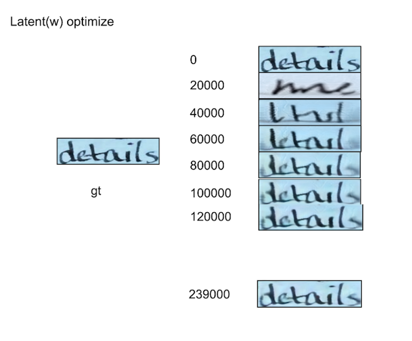
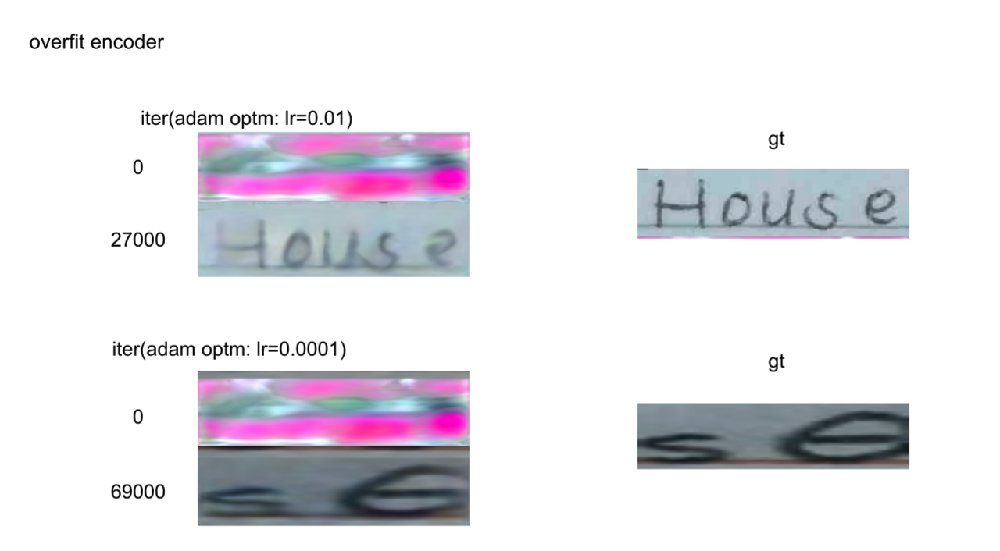
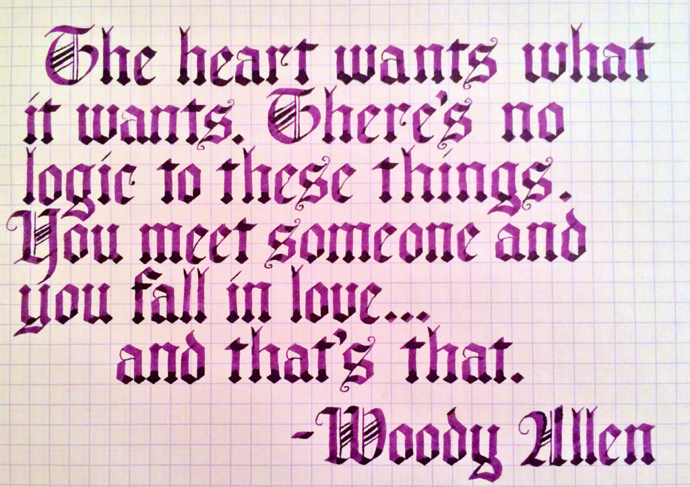
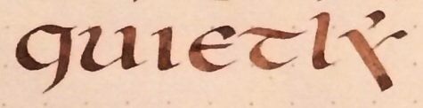
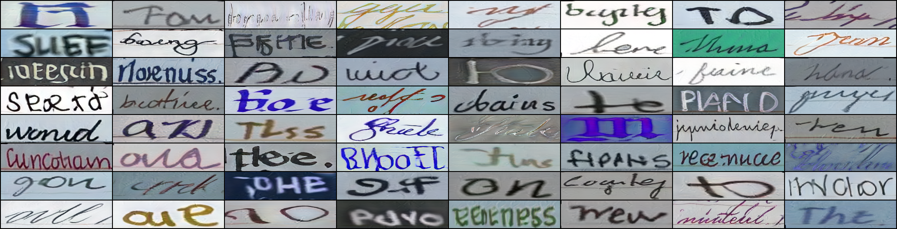

# CLAB/VILBA R&D (Code base: StyleGAN 2 in PyTorch)


## 2022/08/30
- train_encoder_js.py / train_encoder.py / model.py 업데이트
fig.4 
fig.5 


```
# w&z optimization code

python run_optimization.py    \
        --path DATASET_PATH \                   #"root_dir/doc/test_datasets"
        --g_ckpt CKPT_PATH      \               #"root_dir/chekcpoint/100000.pt"
        --exp_name EXP_NAME          \          # experiment name
        --exp_desc EXP_DESCRIPTION   \          # experiment description
        --run_w_optimizer   \                   # Replace "run_z_optimizer" instead for optimization
        --visual_step 1000
````

```
# style encoder optimization

python train_encoder_js.py\
        --exp_name EXP_NAME \
        --exp_disc "test_overfit_style_encoder_only"\
        --lr 0.01\
        --visual_every 1000\
        --save_every 3000\

```

## 2022/08/22
- IMGUR5K_handwriting dataloader 추가(preprocessing.py) -> fig.1, fig.2
- Generated images from from-scratch trained TSB generator(generate 64*256-res samples) -> fig.3
- Style Mixing code 추가 & Style Mixing feasibility check. -> [구글드라이브](https://drive.google.com/drive/folders/1CbfkAZASB9xhFfRlhryzOS-01qDgtmhv?usp=sharing)


fig.1 
fig.2 
fig.3 


